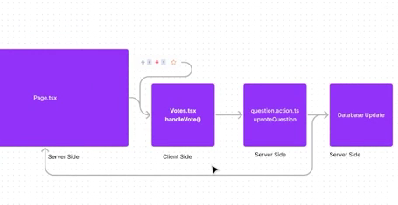

# INTRO TO NEXT

React came in 2015

JS came in 1995 by Brandon Icke of Netscape.

Why these modern frameworks like REACT and Angular make web development easy?

A.

1. Architecture - React and Angular follow a component based architecture. This encourages code re-usability.

This reusability enhances the maintainability and scalability of the application.

2. Virtual DOM - Virtual DOM is a lightweight representation of the real DOM. It gives optimized and efficient updates to the user interface. This improves the performance of the app.

It tracks changes in the app and performs a diffing process (i.e. comparing current dom version to the previous dom version and incorporating those changes).

3. Ecosystem and community

These new frameworks gives the developers:

- Abundent resources
- Extensive Documentation
- Reusable Code Packages
- Bug Fixes
- Support

Guillermo Rouch made Next.js and Socket.io in 2016

Some features of Next.js:

- File Based Routing
- Automatic Code Splitting
- Hybrid Rendering
- Internationalization
- Image and Font Optimization
- HMR (Hot module Replacement)
- Built in support for Sass
- CSS Modules
- Data fetching choice
- Error Handling
- Metadata API (for SEO)
  etc.

What is a framework?

In software development, a framework serves as a tool equipped with a predefined rules and conventions that offer a structured approach to constructing an application.

It provides an environment that outlines the :

- Overall architecture
- Design Patterns
- Workflows

This makes the developer focus more on logic than in low level design.

In leyman's terms, a framework provides pre-built solutions for common functionalities such as:

- Integrating Databases
- Managing Routing
- Handling Authentication etc.

Next.js is built on top of react.js.

Why use frameworks like NEXT

- They take less tooling time

Every aspect of frontend innovation has seen innovations in:

- Compiling
- Bundling
- Mintifying
- Formatting
- Deploying
  etc.

In NEXT, we donot have to worry about configuring these tools, rather we can invest more time in writing react code.

We can focus more in business logic of routing, data fetching, rendering, authentication etc.

Next js is a full stack framework.

Next js has built-in features like:

- Server side rendering
- Static site generation
- Automatic code splitting
  etc.

This gives us the following benefits:

- Optimize application performance
- Enable faster initial page load times
- Improve SEO
- Enhance the user experience

Next js automates many aspects allowing us to focus more on utilizing the features rather than dealing with infrastructure and boiler plate code.

This approach follows the principle of convention over configuration.

SSR (Server Side Rendering) and SSG (Static Site Generation) in NEXT helps in improving SEO of our apps.

In Normal cases the site sends a small html file and a large JS file as response when SEO client requests the site. This results in poor SEO.

In Next, the client gets a large HTML file and a small JS file, this makes it easier for the SEO crawlers to go through the contents of our app and read it, thus improving its SEO.

## How Web Works?

1. Traditional Vanilla Approach

Here we have HTML, CSS and JS as code files which make up the web site.

For a single page web site:
First the client request for the site, then as response the HTML file is sent to them, after that the CSS file styling is applied to it and finally JS file adds functionality to it.

Most of the processing and rendering is done by the web browser on the client side.

For multiple web pages website:
Client makes request for each page to the server and in response each page follows the same process as that followed by a single web page, one after the other.

Bandwidth -> As the number of pages in the website increases and the website starts to get more complex, the bandwidth of it starts to increase.

2. React Approach

React introduced components, virtual dom and client and server mechanism.

When the client visits a react site and requests for the website, the server sends a minimal html file, and a JS bundle file.

React initialtes the client side rendering using this JS bundler file, and manipulates the virtual DOM.

React does not modify the real DOM but only updates the necessary change in the virtual DOM and then compares it with the real dom.

React uses its own client side routing library called react router, which is used to navigate to different locations within the react app.

This library helps us to change the route without a full server request. This prevents the page refreshes.

If a new route is triggered, it renders and re-renders the necessary components needed for that page.

If any component is fetching data from the server, it makes a request to the server.

Here using react, complexity increases as compared to vanilla approach.

Also client side rendering + using JS to render files does not help to increase SEO.

3. Next JS approach

Here while using NEXT JS we can choose whether to render the components on the client side, or on the server side.

When a user visits a NEXT site and the client makes a request, the client sends a request to the server, which starts executing the react components, generates the HTML, CSS, and JS files and sends a fully rendered HTML file back to the client as a response.

This HTML file contains:

- Initial Content
- Fetched Data
- React Component Markup.

making the client render it immediately without waiting for the Javascript to download and execute.

Though it does not mean we donot need any JS file, the server sends back the JS file as needed for user interaction.

From here Next js takes over and performs client side hydration.

### Hydration and Hydration Error:

Hydration is attaching Javascript event handlers and interactivity to the pre-rendered HTML.

And when the placeholders of the react components eg: div, form, span donot match with what is being rendered on the client side, we get the hydration error.

### Routing in Next JS

In NEXT, we have file based routing. This means that to make a route we have to create a folder (say about (🛑 all lower case, this is mandatory)) and inside it we make a file page.js or .jsx or .tsx (whichever you like).

This way we can make routes. Also in addition we can include a ui file having css code to style the routes.

In react, we used to make routes and nested routes using createBrowserRouter and route, routes, links from react router dom and we used to update it by importing the route in every page.

If you want to import a navbar component, either you can import it in each page (like we did in react) or import it in the parent component of these routes i.e. use layout.tsx to import it in every page (this is a better option).

This however gets very complicated in larger websites which have a lot of pages with nested routes. Next solves this problem by simply adding routes to the parent element i.e. app folder (keep in mind that next is a framework so rules are very strict.)

For nested routes make nested folders.

eg.

- about folder
  - projects folder
  - page.tsx (of project)
- page.tsx (of about. Include a link here which can take us to projects page i.e. /about/projects. Also a normal content for about page.)

Dynamic Routes - This is same as nested routes but here the name of the route and its data is not fixed. It can change.

🛑 To create a dynamic route, we wrap the folder's name in square brackets. This symbolizes that it is of the same name as the name of the folder and the content inside the square bracket is a variable.

eg.

- projects (main folder)
  - [slug1 say volcano project]
    - page.tsx
  - [slug2 say doctor project]
    - page.tsx
  - [slug3 say car project]
    - page.tsx
- page.tsx (here we include a ul of links for dynamic routes and their styling files)

But all these won't change the title name according to the folder(route here) name.
To do so, use {params} and in the content, use {params.name}. This will show title of the dynamic route name and not a fixed text title.

#### Route Groups

In next js' file based routing system, there are many folders and files inside the app folder as routes. These can sometimes become a little bit intimidating and scary.

To reduce this hotch-potch, we have route groups in next js.

🛑 To include folders in route groups, we enclose the folder name in parenthesis (). Inside that we can do as we want.

eg.

- app
  - auth
    - sign-in
      • page.tsx
    - sign-out
      • page.tsx

Now for sign in page, the route is auth/sign-in but say we donot want /auth to be with sign-in (we want only /sign-in). For this we use route-groups.

- app

  - (auth)

    - sign-in
      • page.tsx
    - sign-out
      • page.ts

  - (dashboard)
    - home
      • page.tsx
    - about
      • page.tsx
    - contact-us
      • page.tsx

Now we have 2 different route groups, one having routes for auth and another having routes for dashboard.

## Routing Qs:

### Q1. Explain how Next.js routing differ from react.js routing?

### Q2. What is the purpose of route groups and how can they be created in next.js?

In the app directory, nested folders are normally mapped to URL paths. However, you can mark a folder as a Route Group to prevent the folder from being included in the route's URL path.

This allows you to organize your route segments and project files into logical groups without affecting the URL path structure.

Route groups are useful for:

Organizing routes into groups e.g. by site section, intent, or team.
Enabling nested layouts in the same route segment level:
Creating multiple nested layouts in the same segment, including multiple root layouts
Adding a layout to a subset of routes in a common segment
Convention
A route group can be created by wrapping a folder's name in parenthesis: (folderName)

### Q3. What is a dynamic route and why should we create dynamic routes in web applications?

# 🛑 011_Routing:

DevFlow Routing:

Here just create a new branch 011_routing and then publish it.

make an (auth) route group

then insert 2 route folders => sign-in and sign-up.

Also make a layout.tsx folder in (auth) for both of them.

We are doing this as we want a navbar and footer in all pages, except for a login ui page.

Create page.tsx for both sign-up and sign-in and then do rafce in both.

🛑 After running them, we get a run-time error. This is because, we need to mandatorily export a child from layout.tsx in (auth).

Other routes apart from (auth) will be in (root).

Inside we make (home) and put a page.tsx there. This will replace the default page.tsx of next js hence we will delete the default page.tsx.

# Client vs Server Paradigm

Next js is a mix of both client side and server side.

Clients are usually the devices that we're using like smartphone or computer.

The device sends requests to the server and displays the interface that we can interact with.

The server is just a computer but it is equipped with a strong configuration and remains operational continously. It is the place where all the code for the application is stored.

In earlier versions of next, the server side rendering was only limited to individual pages.

This led to challenges such as prop drilling and duplication of API calls when passing data to lower components.

[READ THIS BLOG:](https://vercel.com/blog/nextjs-app-router-data-fetching)

The NEXT JS 13 App Router brought component level server side rendering.

Using this we can choose to render a component at client side or server side.

This gives us client side and server side components.

Both are react components.

Client side component is rendered at client side in our mobile and computer browsers.

Server side component is rendered at server side where our application is deployed.

Benefits of using Server Components:

1. Small size of JS bundler file: Rendering small components on server side gives us HTML files and thus reduces the burden of the JS bundle files.

These HTML files load a lot quicker than normal JS bundle files (when using react way). This loads our website a lot faster than react sites.

2. Enhanced SEO

3. Faster initial page loading

4. Efficient use of server resources.

## Q. When to decide what to render where?

It depends on what the component does.

If the component needs the user to interact with it like clicking buttons, giving user inputs, triggering events, and using react hooks; use a client component.

If the components does not need any user interactions and needs fetching data from the server, displaying static content, performing server side computations; use a server component.

### In next JS 13's App directory, all components are considered server components by default.

To treat a component as a client component, just put "use client" on the top of the file.

## Next JS does "static rendering" i.e, it pre-renders the necessary content on the server, before sending it to clients.

This pre-rendering process includes server and client components.

USE CLIENT serves as a boundary between client and server components.

## Do not include server components inside the client components.

## Q. What are the different types of components in next.js and explain their differences?

## Q. What are the benefits of server side rendering?

## Q. What are the latest features of the app directory regarding the client / server rendering?

# Rendering: It is a process of creating the user interface from the code we write.

If the page needs the user to interact with it like clicking buttons, giving user inputs, triggering events, and using react hooks; use client side rendering.

If the page does not need any user interactions and needs fetching data from the server, displaying static content, performing server side computations; use server side rendering.

The time: Once the compilation process is complete, which involves converting the code from a higher level programming language to a lower level representation (binary code), our application goes through two crucial phases: Build Time and Run Time.

Build time is where we compile our code.

Run time is when we are running our code.

Run time environment (RTE) is different from run time.

RTE is an environment in which the program or application runs during its execution. It supports a set of libraries, services and run time components that supports the execution of the program.

Node JS is a JavaScript run time environment.

NEXT gives us these 2 runtime environments:

1. Node.js run time - Default Node JS run time that has access to all the Node.js APIs and the ecosystem.

2. Edge run time - A lightweight run time based on web APIs with support to a limited number of NODE JS APIs.

## Use this command to switch your runtime in NEXT

`export const runtime = 'nodejs' (or 'edge')`
Node JS is the default runtime.

## Rendering Strategies provided by NEXT.js for rendering on the server:

1. Static Site Generation
2. Incremental Static Generation
3. Server Side Rendering

### Static Site Generation (SSG)

This happens at build time on the server.

In SSG, during the build time, the content is generated and converted into HTML, CSS and JS files. It does not require server interaction during run time. The generated static files can be hosted on content delivery network (CDN) and then served to the clients as it is.

The result is, the rendered content is cached and re-used on subsequent requests leading to fast content delivery and less server load. This minimal processing results in higher performance.

Although the SSG handles dynamic data during the build process, it requires a re-build if you update anything, as it happens during the build time.

Eg. Blog or News websites, all articles and content are 80% static, if we want to update any article, we re-build it.

### Incremental Static Generation (ISG)

It allows us to update these static pages after we build them, without needing to re-build the entire site.

The on-demand generation of ISR allows us to generate a specific page on-demand or in response to a user's request. Meaning a certain part of the websites or pages will be rendered at build time while the other is generated only when needed, i.e., at run time.

This reduces the build time, and improves the overall performance of the website by updating only requested pages for re-generation.

With this hybrid strategy, we now have the flexibility to manage content updates. We can cache the static content as well as re-validate them if needed.

An example use case would be the same where we can use SSG for the article details page and use ISG for showing the list of articles.

### Server Side Rendering (SSR)

Dynamic Rendering in a nutshell. Enables the generation of dynamic content for each request, providing fresh and interactive experiences.

#### If we have SSG and ISG why do we need SSR

Both SSG and ISG are good, but it is needed where specific use cases are needed.

SSR excels in situations where a website heavily relies on client side interactivity and requires real time updates. It is particularly well-suited for authentication, real time collaborative applications such as chat platforms, editing tools, and video streaming services.

SSR involves heavy server side processing, where the server executes code for each individual request, generates the necessary HTML, and delivers the response along with the required JavaScript code for client side interactivity.

Limitations- Due to its dynamic nature, caching content responses becomes more challenging, which results in increased server load when compared to SSG or ISG.

However the benefits of real time interactivity and up-to-date content makes SSR a valuable choice for specific application requirements.

🛑 By default NEXT uses SSG rendering.

We can easily switch to ISG or SSR in different pages in our NEXT app.

🛑 When to use SSG - When a page or content displays the same information on each request.

🛑 When to use ISG - When a page or content requires frequent information updates, potentially every second.

## Q. What does rendering mean? Explain the different rendering strategies in NEXT.js?

## Q. What is build time and run time. Explain the difference between them in a Web Application life.

We have build / compile time where we prepare our application code for production and it involves the steps like code compilation, bundling, optimization etc.

In short build time is where we compile our code.

`npm run dev` is that command where we build our app which has all the static files, bundling optimization, dependency resolution etc.

Run time is that time where our compiled or deployed application is actively executing and running, involving the dynamic execution of the application's code and the utilization of the system's resources.

In short run time is the time when the user is running our code.

It is about handling user interaction like user input, responding to events and data processing (like manipulating or accessing data) and interacting with external services or APIs.

## Q. What are the benefits of rendering content in a client vs server environment?

Rendering content in a client:

- Rendering Process: Occurs on a user's browser.

- Interactivity and Load time: Provides a dynamic and interactive user experience.

- Fetching and SEO: Smoother transition between the pages and real time data fetching.

- Load and Performance: Reduced server load and potentially lower hosting costs as the client's browser is responsible for handling the rendering.

- Consistent Rendering: Compatibility and performance depend on the user's device configuration.

- Security: Potential risk of security vulnerabilities such as cross site scripting (XSS), Code Injection, Data Exposure etc.

Rendering content in a server:

- Rendering Process - Happens on the server before we send the page to the client's browser.

- Interactivity and Load time: Provides a fully rendered HTML page to the client resulting in faster initial page load time.

- Fetching and SEO: Fully rendered content enhancing the search engine rankings and social media sharing previews.

- Load and Performance: Performs well on any slower device as rendering is done on the server.

- Consistent Rendering: Consistent rendering across any devices regardless of the configuration reducing the risk of compatibility issues.

- Security: Reduces the amount of client side JavaScript code sent to the user's browser thus enhancing security by limiting the potential vulnerabilities.

## Q. Imagine you are developing a large scale e-commerce platform that requires a rendering strategy to handle a high volume of product listings. The platform needs to display product information, pricing, availability, and customer reviews. Additionally, the platform aims to provide a fast and interctive user experience. Considering the complex requirements of the e-commerce platform, discuss the trade-offs and factors you would consider when choosing between Static Site Generation (SSG) and Server Side Rendering (SSR) as the primary rendering strategy.

# Auth

There are many libraries and packages for auth like, Passport, or OAuth, or NextAuth, or Clerk

### We will use Clerk here

"Clerk" works wonderfully with Next13 and SSR.

Make an account in clerk => name your folder => Choose Sign in options => Choose Next JS => And follow the steps given there

(https://dashboard.clerk.com/apps/app_2fuoef1uS4fZEDVK9USFnCGjpqH/instances/ins_2fuoenGClYURgeVfzzcNmHpoal5)

Steps:

1. Install @clerk/nextjs
2. Set your environment variables
3. Update middleware.ts (🛑 this steps solves the problem of showing and hiding specific files. Earlier we used to ask every time whether the user is logged in or not. If yes then go ahead and if not then redirect the user. Here we can do the re-directions directly with the help of clerk, we just need to create a middleware file. Make it in the /root folder).
4. Add ClerkProvider and components to your app (go to app/layout.tsx and paste the code)
5. Create a home page

Making Custom Sign-up and Sign-in pages:

1. Building a sign-up page:
   Follow this special folder structure.

app/sign-up/[[...sign-up]]/page.tsx

(Move the original page.tsx inside the sign-up folder to this new folder)

2. Building a sign-in page:
   Follow this special folder structure.

app/sign-in/[[...sign-in]]/page.tsx
(Move the original page.tsx inside the sign-in folder to this new folder)

3. Update your environment variables (in .env.local)

4. Do `npm run dev` to test it.

## Using React Context for State Management with Next.js

In next js we try to keep everything, server rendered. We can use context only when we use hooks, but hooks by default are client side which eliminates the possibility of things to be server rendered.

[DOCS](https://vercel.com/guides/react-context-state-management-nextjs)

Context is a feature of React, a popular JavaScript library for building user interfaces, that enables components to share data without passing props down manually at every level of the component tree. This is particularly useful for data that can be considered "global" for a tree of React components, such as user authentication status or theme preferences.

Keep in mind that context providers are typically rendered near the root of an application to share global concerns. However, creating a context at the root of your application in Next.js will cause an error in server components. Let's see how to handle this.

### Rendering Third-Party Context Providers in Server Components

In Next.js, React Server Components don't support creating or consuming context directly. If you try to create a context in a Server Component, it will result in an error. Similarly, rendering a third-party context provider that doesn't have the "use client" directive will also cause an error in Server Components.

Instead, you can create your own Client Component that wraps the third-party provider.

By rendering the providers at the root level, all the components throughout your app will be able to consume the context provided by the third-party libraries.

It's worth noting that you should render providers as deep as possible in the component tree.

We already did something like this in layout.tsx. We wrapped our body and children with clerk provider which allowed us to use clerk provider in our entire next js app.

Steps:

1. Create a Context
2. Provide a value to that context using Provider.

🛑🛑 ERROR: createContext in a Server Component
Why This Error Occurred
You are using createContext in a Server Component but it only works in Client Components.

Possible Ways to Fix It
Mark the component using createContext as a Client Component by adding 'use client' at the top of the file.

If we use 'use client' and wrap it, will our code become client side? 🛑Not at all!!

Let us create a context for switching theme between light and dark mode, for that, go to context > ThemeProvider.tsx

🛑🛑🛑 NAVBAR

Now for a navbar, we want it in the root route group and not in the auth route group as we do not want the navbar in signin and signup pages. Hence we create a new layout.tsx for navbar inside (root)

Now in components folder, we have a shared folder, this will store components which will appear on all pages like navbar.

Import it then in the layout.tsx of (root).

🛑🛑 [Installing ShadCn Ui:](https://ui.shadcn.com/docs/installation/next)

WE have installed Button and a menubar from ShadCN.

Now working on Theme.tsx in components > shared > navbar

Now to work over things like light, dark and system mode in theme change menu, we will loop through the items in this menu.

Now to avoid working and writing that piece of code again and again, we can create a constants folder and write our code (code which we will use time and again) there.

Now we will work on the navbar in mobile mode which will look a bit different with a hamburger menu.

🛑🛑 For this: Create a page MobileNav.tsx inside components > shared > navbar

To make this mobile nav, we will use a "SHEET" from ShadCN.

It is a slider menu which appears from the side when we click on the hamburger icon.

[SHEETS](https://ui.shadcn.com/docs/components/sheet)

After working on MobileNav, we are working on NavContent function. This will allow us to make the buttons and links to different pages in the Mobile Navbar (which slides in from the left via sheets).

After doing Mobile Navbar, we are implementing Global Search.
For this we will create a new Search Folder inside shared folder. This will have all the shared components that we need.
Inside that search folder, make there a "GlobalSearch.tsx" file

🛑🛑🛑🛑 For SVG Icons: https://flowbite.com/icons/

🛑🛑 Section 1:
Now we work on the Left Side Bar, for that we make the component of LeftSidebar in (root) > layout file active, then we start working on the components > shared > LeftSidebar.tsx.

🛑🛑 Section 2:
Now we work on the Right Side Bar, for that we make the component of RightSidebar in (root) > layout file active, then we start working on the components > shared > RightSidebar.tsx.

Now while working on the right side section's HOT QUESTIONS part, we will later apply a recommendations algorithm which will take us to the asked question when we click on it directly.

For now, we will just use a piece of text to map over it and see if it is working in the front end part or not.

Now for Popular tags, we see that these tags are used in many parts, so for that, we will make a new file:
devflow > components > shared > RenderTag.tsx

Now for tags in Render Tags page, we will use Badge component for the layout.
🛑🛑 // https://ui.shadcn.com/docs/components/badge

🛑🛑 Now we will create our local dearch bar component, for that we will make this following file: components > shared > search > LocalSearchbar.tsx.

Then activate it as a component in: app > (root) > (home) > page.tsx

🛑🛑 Now we will create our filter component, for that we will make this following file: components > shared > Filter.tsx.

Then activate it as a component in: app > (root) > (home) > page.tsx

Now for filters, we will need another Shadcn component, here we have taken the help of "Select"

[Select Shadcn Docs](https://ui.shadcn.com/docs/components/select)

Now for the Home Page Filters in Tag form, create a new component in: components > home > HomeFilters.tsx.

Also call it in app -> (root) -> (home) -> page.tsx in Home() function.

Now we will start making the Home Page Card Components in (root) -> (home) -> page.tsx in Home() function, below HomeFilters component.

Now first part in the Question Card is making the NoResult Component.
For that, let us make the following: components > shared > NoResult.tsx

and import it in app > (root) > (home) > page.tsx in Home()

Now we start making the QuestionCard. For that we will first make a cards folder in components > cards > QuestionCard.tsx

and import it in app > (root) > (home) > page.tsx in Home()

Now inside the QuestionCard, we see a format where we have image on the left and text on the right, like for author, like , answers and views. These are called "metrics". We make these as re-usable components.

Let us do the following: components > shared > Metric.tsx

and import it in components > cards > QuestionCard.tsx in QuestionCard().

🛑🛑🛑 Inside QuestionCards.tsx Converting the long string time stamp into something nice and readible
🛑🛑 We can create a new utility function and use it across different places go to lib > utils.tsx

Now say in views or answers or other things, say we have a large number like 110000000, this will disorient our card and we will not be able to see things clearly.

For this, let us try to convert 1100000000 to 1.1 Billion or B such format.

For this we will make another utility function: lib > utils.ts

🛑🛑 Now we have started working on Ask a Question Page, for that, we will go to app > (root) > ask-question > page.tsx > Page

Now here we will create our Question Component

components > forms > Question.tsx > Question()

and import it in app > (root) > ask-question > page.tsx > Page

We will first create a form, for that we will import the form component from shadcn UI.

https://ui.shadcn.com/docs/components/form

Here we see that though shadcn has its own components for creating forms, it uses React Hook Form and Zod for creating forms.

Steps to create a form:

1. Install the form component from shadcn ui
2. Create a form schema i.e. defining the shape of our form using "zod"

Zod - TypeScript-first schema validation with static type inference

Zod ensures that the type of data that we are passing in the form is exactly as we have declared it.

3. Define the useForm hook from React Hook Form to create a form.

4. Building a form

Done, we have made a simple form with username and submit button.
This all is in the form schema.

But we need more things in our formSchema i.e. modify our formSchema, for this, we have to take it to 🛑lib > validations.ts 🛑

So copy the form schema and paste it there.

Now if we want to have a special type of validation, we can find built-in validations in zod.

For that go to [Zod Documentation](https://zod.dev/?id=strings)

We can also provide special and customized error messages when we give these validations.

Let us first work on validations.tsx

After working on validations and Question.tsx, and making the form and fields of all three and finishing the first form.

Let us now work on the question description field. For that, we will use the tiny mce editor which is a great what you see is what you get editor.

So first import the tiny mce editor

[Editor Docs](https://www.tiny.cloud/docs/tinymce/latest/react-cloud/)

Then we import the useRef and Editor in components > forms > Question.tsx.

Finally insert the editor component inside the form control tag in the second descriptive field.

Then we work with the Tags in the same Page.

Finally we work on the 'onSubmit' of the form.

🛑🛑 Developing Backend
In components > forms > Question.tsx > Question() > onSubmit() inside try catch

## Next.js server actions

[Docs](https://makerkit.dev/blog/tutorials/nextjs-server-actions)

Next.js Server actions are a new feature introduced in Next.js 13 that allows us to run server code without having to create an API endpoint.

Server Actions are functions that run on the server, but that we can call from the client, just like a normal function. This allows us to run code on the server without creating an API end point. This is a game changer.


### What can we do in Next.js Server Actions

- Writing to a database: We can write to a database directly from the client without creating an API endpoint.
  We just define our logic in the server Action.

- Server Logic: We can execute any server related business logic like sending emails, creating files etc.

- Calling External APIs - We can call the external APIs directly from the server actions without having to create an API Endpoint.

In short, we can do anything we want to do on the server without having to create an API Endpoint.

### Pros of using Next.js

There are a few pros to using Next.js Server Actions:

1. No need to create an API endpoint: you can run server code without having to create an API endpoint.

2. Jumping to the definition: you can jump to the definition of a server action just by clicking on it in your code editor, without the need of searching for it in your codebase.

3. Type safety: you can use TypeScript to define the arguments and return value of your server actions, and Next.js will automatically validate them for you.

4. Less code: you can write less code, as you need a lot less boilerplate to run server code - you can just define a function and its parameters - and then call it from the client.

### Defining Server Actions

🛑🛑 Before Next 14

in next.config.js file:

```
/** @type {import('next').NextConfig} */
const nextConfig = {
  experimental: {
    serverActions: true,
  };
}

  module.exports = nextConfig;
```

🛑🛑🛑 Next 14

in next.config.mjs file:

```
/** @type {import('next').NextConfig} */
const nextConfig = {};

module.exports = nextConfig;

```

#### Defining a Server Action in a Server Component

If you are defining a server action in a server component, the only thing you need to do is to define a function with the `use server` keyword at the top.

For example, the below is a valid server action:

```
async function myActionFunction() {
  'use server';

  // do something
}
```

Very important: server actions functions should have serializable arguments and a serializable return value based on the React Server Components protocol. This is because the function's response will be serialized and sent to the client.


To execute this in devflow go to:

lib > actions > question.action.ts

Also add the below code in next.config.js > nextConfig

🛑 To create our database, we make a file:

lib > mongoose.ts

Mongoose is just an elegant mongodb object modelling for node.js.

It allows us to create models more quickly in our mongodb database.

Mongo DB on the other hand is just a database for our documents.

In MongoDB we create a project, create a cluster, add an IP address, (user name and password in .env.local) and finally connect it using "DRIVERS" i.e. Node.JS

Now make sure node is installed

Run this in terminal: `npm install mongodb`

Finally copy this string in our devflow code to make our connection:

`mongodb+srv://kaustubhyaksd:<password>@cluster0.6zyruyj.mongodb.net/?retryWrites=true&w=majority&appName=Cluster0`

(Update the (password) that we saved in .env.local and put it above)

Now go here: https://cloud.mongodb.com/v2/6647c69b0cf72650c25883ac#/clusters (Deployment > Database) and see if our clusters are connected or not.

Go to .env.local for that.

Let us resume our work from mongoose.ts

🛑 Let us now focus on creating the question model, for that we will go to database > question.model.ts

🛑 Let us now focus on creating the user model, for that we will go to database > user.model.ts

🛑 Let us now focus on creating the tag model, for that we will go to database > tag.model.ts

🛑🛑 We will now create some question actions, for that we need to go to lib > actions > question.action.ts

To see the Relation between Question and Tag see here (how we connected and established a relation between Question and Tag in question.action.ts)


After linking the question with the tags, let us create a user into the database, for that go to MongoDB Atlas > Database > Cluster0 > Collections > Add my own data give a DataBase name it.

🛑 The name of db created should be the same as mentioned in our mongoose.ts file.

Give collection name "users" and create it.

Now after the database is created, insert a document (on the right hand side).

There we will insert the dummy user object we created (in JSON via ChatGpt) by referring to the user.model.ts interface IUser Interface.

Here is the JSON of the dummy object to be inserted

```json
{
  "_id": { "$oid": "664bf5d74d2919d6d73c40b6" },
  "clerkId": "clerk12345",
  "name": "John Doe",
  "username": "johndoe",
  "email": "johndoe@example.com",
  "password": "supersecurepassword",
  "bio": "Full-stack developer with a passion for open-source projects.",
  "picture": "https://example.com/pictures/johndoe.jpg",
  "location": "San Francisco, CA",
  "portfolioWebsite": "https://johndoe.dev",
  "reputation": 1500,
  "saved": ["60c72b2f9b1d8b3f4c8b4567", "60c72b2f9b1d8b3f4c8b4568"],
  "joinedAt": "2023-01-15T10:00:00.000Z"
}
```

Now we have our first user in the database.

🛑🛑 From here, now we can go to components > forms > Question.tsx > Question > onSubmit() > await createQuestion({});

Now to proceed with author, we need to create a user action for this author,

Go to lib > actions > user.action.ts

Now go to the page which calls the question page ie app > root > ask-question > page.tsx

🛑🛑 To fetch our questions right here, let us first find where we're displaying this fake data. It is at app > (root) > (home) > page.tsx

So go just below Home() and fetch real questions from there.

But first, let us first create the server action for this and then come back to Home().

So go to lib > actions > question.action.ts.

🛑 One important note here is, for every action, we have to export an async function, pass params as props and make their interfaces.

So to save time, let us make this all at once in lib > actions > shared.types.d.ts

d.ts -> this provides the typescript information about an API that is written in JavaScript.

So let us go there.

After filling that file, we go to question.action.ts, import getQuestions from shared.types.d.ts and work on it.

Also to make the new questions appear on top, we use .sort({ createdAt: -1 })

Also we needed to reload the window to make the new questions appear, to prevent this, we used `revalidatePath()`. Now we can see the newer questions at top without the need to reload.

`revalidatePath()` allows us to purge cached data on demand for a specific path.

use the pathName with this.

Now for just displaying a question, we created question, got questions, created models of question, user, tag, connected to databases, used server actions and so much.

Next we will make the users from our clerk database, be connected to and visible in our mongodb database and not the dummy user.

🛑🛑 Till now we have been working with 2 different databases:

- Clerk: This was handling our user info and authentication
- MongoDB: Handling other things

we will connect these 2 databases using WEBHOOKS.

🛑 Webhooks are like a phone call or a message that a website or an app makes to another website or app when something important happens.

Working Process:

1. An Event is Triggered (like user signing in, signing out, deleting his account etc.)

2. We get a notification (in this case, we get a request with a payload)

3. Event processing - This connection between 2 databases allows the mongo db to update the changes whenever it gets a notification from Clerk regarding an event happening.

We set up a webhook, listen to an event and take action regarding it once. Then it will happen automatically as the 2 databases will always be in sync.

If we go to [clerk docs](https://clerk.com/docs/integrations/webhooks/overview), Clerk webhooks allow you to receive event notifications from Clerk, such as when a user is created or updated. When an event occurs, Clerk will send a `POST` request to your webhook endpoint configured for the event type. You can then use the information from the webhook's request payload to trigger actions in your app, such as sending a notification or updating a database.

Clerk uses `Svix` to send our webhooks. This ensures security and authenticity of the incoming webhook requests. This makes sure that webhooks are coming in from the clerk system and are not tampered during transit. This helps us secure the user data.

We want to focus on the following webhooks:

- email.created
- user.created
- user.updated
- user.deleted

🛑🛑 First we install svix do: `npm install svix`

Next go to app > api > webhook > route.ts

To see the USER details when user is created go here: (C:\Next Adrian\devflow\node_modules\@clerk\backend\dist\api\resources\JSON.d.ts)

Now we will create a new user,

To create a new user, go to lib > actions > user.action.ts

🛑🛑 We will now deploy our website in its current state to test out the webhooks, for that:

- signin to vercel
- choose your github repo
- once selected, go the the repo dashboard, then go to settings > domains (on left sidebar) > edit the git branch from main to 026_webhooks_user_creation
- push a new commit inside the 026_user_creation branch

When the site is deployed, you will visit to your new site,
https://dev-flow-cm7z4j4r7-kaustubhya-s-team.vercel.app

Also I copied the above URL and pasted it in TinyMCE's website where I can allow the available list of URLs that can show my editor. Otherwise the editor would have been in read only mode.

Now go to clerk dashboard > webhooks > add endpoint url

Add this url: https://dev-flow-cm7z4j4r7-kaustubhya-s-team.vercel.app/api/webhook

Click the user updated, user created and user deleted boxes

Click create.

Now we get a signing secret, copy it and paste it in .env.local

Now to test if the webhook is working or not, go to middleware.ts and add the webhook route

🛑🛑 If something is broken with the frontend, we can go to inspect > and see the errors in the console.

🛑🛑 If something is broken with the backend, go to vercel > deployed project's logs and see the errors there.

https://vercel.com/kaustubhyas-projects/dev-flow-ksd/logs?slug=app-future&slug=en-US&slug=kaustubhyas-projects&slug=dev-flow-ksd&slug=logs&page=1&timeline=past30Minutes&startDate=1716606836655&endDate=1716608636655&selectedLogId=1716608636655863665589100000&selectedLogTimestamp=1716608636655&forceEndDate=1716608636655

We have to add the webhook signup key from our .env.local to vercel > settings > environment variables

Go to deployments > ... (on right side end of our project) > Re deploy

Test the webhooks either in clerk dashboard, or by making changes in localhost and seeing the vercel logs or clerk messages.

IT TOOK ME 12 HOURS TO RESOLVE THIS 😭😭😭😭😭

Finally, we see our updated clerk user id in our mongo db database

Now let us go to app > root > ask question > page.tsx

Remove the fake user and comment out the userId from auth, also import auth

🛑🛑 Now to fix the small profile photo that comes before the user in the question card, for that do the following:

- in components > cards > questioncard.tsx
  change the metric tag of user, use this code:
  `imgUrl={author.picture}`

  - we get an error saying the image is being served by clerk.
  - for that go to next.config.mjs

  🛑🛑🛑🛑 Community Page
  Let us start with building the community page, for this go to app > (root) > community > page.tsx

  After putting in the reusable components of local search bar and filters, we will go to lib > actions > user.action.ts to create a getAllUsers function there, which will fetch all of our users from the backend.

  After that in community > page.tsx, we style it a bit and then let us create a card component to display all users.

  Go to components > cards > UserCard.tsx

  Creating Tags in a community page can be a little tough as we have to fetch all the questions that the user has asked and the tags associated with it. Similarly what tags has the user used while answering to a question.

  For that, we need to create a tag action, so go to lib > actions > tag.action.ts

  🛑🛑 After making the community page, let us work on making the tags page, go to : app > (root) > tags > page.tsx

  Now to fetch all tags, go to lib > actions > tag.action.ts and then use that fetch the tags and then to go back to our tags page

🛑🛑🛑 Now we will create our question details page, i.e. the page that appears when we click a question.

For this, we can create our first dynamic route, so go to app > (root) > question > [id] > page.tsx

Now we might be wondering how did we get to this page while clicking on a question and what is the ID of the question we are currently looking at.

For this, we can access something called `searchParams`.
For now it is empty but we will fill it later on.

Now to get just the Id of the question, we can use `params`.
We get the ID now.

So the key here is the [id], (look at the file structure of the page.tsx in question) and the value is the id of the question we get when we use params, we can get this value easily when we see the url of our app (http://localhost:3000/question/665543c4a52092db2b2e069b), see the value (id) after /question.

So let us start with the UI, go to the page.tsx

Our first task in the UI of this page is to fetch all the details of the question based on its param ID.

Foe that we can simply go to lib > actions > question.action.ts and make a function called (getQuestionById)

Do the remaining work on app > (root) > question > [id] > page.tsx.

🛑 Now to display the code bit in this page, we will create a new component, do: components > shared > ParseHTML.tsx.

🛑 Now to display beautiful colored code bits, we can use a library here, called `Prism.js`, this will show us the desired code colored bits according to the language provided.

Prism is a lightweight, extensible syntax highlighter, built with modern web standards in mind. It’s used in millions of websites, including some of those you visit daily.

Used by:

- Smashing Magazine
- A List Apart
- Mozilla Developer Network (MDN)
- CSS-Tricks
- SitePoint
- Drupal
- React
- Stripe
- MySQL

Now we will use 2 prism packages here,

- For normal Markdown Content, we will use npm html-react-parser package
- For code content we will use npm prismjs package

Install both of these together

`npm install prismjs html-react-parser`

Now go to components > shared > ParseHTML.tsx.

🛑 After making the necessary imports and modifications, we need one more thing: we need the necessary CSS to use with Prism, so for that we need to make a CSS file for prism, go here for the CSS Prism file: styles > prism.css.

This will give us our highlighting.

🛑 Now go to App > layout.tsx, `import '../styles/prism.css';` just below `import './globals.css'`

Prism over....

Go back to app > (root) > question > [id] > page.tsx,

first we worked with rendering tags.

🛑🛑🛑 Now we want to display all the answers to our question. For that, we will use an Answer Form to show all the answers to our questions.

Go to components > forms > Answer.tsx

Now first we create a form using React Hook Form and ShadCN UI.

Next we have to create an Answer Schema, for that we have to go to lib > validations.ts

After that go back to components > forms > Answer.tsx

🛑 Let us create our new answer model now, go to database > answer.model.ts

🛑 Let us create an answer actions now:

For that go to lib > actions > answer.action.ts

🛑🛑 Let us now integrate the Answer Action inside the answer form. For that, let us go to components > forms > Answer.tsx. We will work on handleCreateAnswer().

🛑🛑 Let us now work on displaying all our answers, for that, go to lib > actions > answer.action.ts > getAnswers

We created the getAnswer action there.

🛑 Now we need to show all the Answers on top of the Answer Editor, for that we will create another new component,

go to components > shared > AllAnswers.tsx
(call it in Answers.tsx above (Answers) component)

🛑🛑🛑🛑 Let us now start working on Voting.

For that, go to components > shared > Votes.tsx

and import it in: app > (root) > question > [id] > page.tsx > Page()

🛑 Let us now create server actions for upvoting and downvoting

go to lib > actions > question.action.ts

🛑 Time to integrate backend to frontend, go to handlevote() in components > shared > Votes.tsx

Voting Working


🛑🛑 In the same way we create voting actions for answers, see question.action.ts and Votes.tsx for more.

🛑🛑 Now let us work on Saving Questions functionality, this is only applicable to questions only (so we rendered this on the question part only (conditional rendering of this))

In Votes.tsx, we will work on handleSave(), but first we need server action for this.

This will go in user.action.ts as we have to save questions for a particular user.

So go to lib > actions > user.action.ts

After that is done, we worked on the handleSave functionality in Votes.tsx.

We see now in our mongodb atlas in users section that if we save a question, we can see the saved array getting populated.

So this functionality works well.

🛑🛑 Let us now work on the collections page where we display all of the saved questions of a user.

🛑 For that let us go to app > (root) > collection > page.tsx

Process is same, we will go to lib > actions > user.action.ts; make a function: getSavedQuestions and then go back to app > (root) > collection > page.tsx

🛑🛑🛑 Now we will implement the views functionality i.e. we will be able to see how many views a question gets and we will be able to see it in the question card. For that we will create a question details page view.

🛑 Also we will create a new server action for this, go to lib > actions > interaction.action.ts

🛑 Also we will create a new model for this action. Go to database > interaction.model.ts

First make model, then make server actions, then use them in Vote.tsx in a useEffect hook.

🛑🛑🛑 Let us now start working on our tag details page, i.e. we will make a page for all the tags that are clicked and we will show all the respective questions related to those tags.

It is similar to the question > [id] page where we had a page for each question.

So similarly, we will use dynamic routing for this. Go to app > (root) > tags > [id] > page.tsx.

We keep the tag details page and tags page under the same parent root folder i.e. tags, just that this page is for each tag id, hence the dynamic routing.

Let us make an action for this too, in tag.action.ts > getQuestionByTagId

🛑🛑🛑 Let us now create a profile page, for this we will have to do: app > (root) > profile > [id] > page.tsx

Now to update the dynamic routing nature of Profile page, go to LeftSidebar.tsx .
